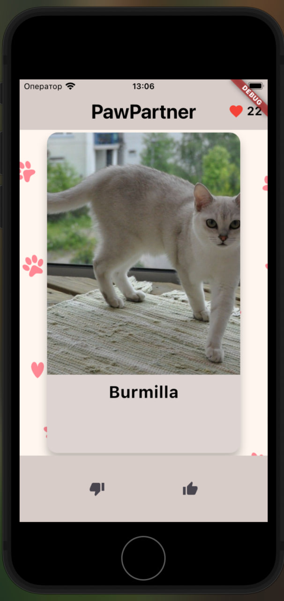
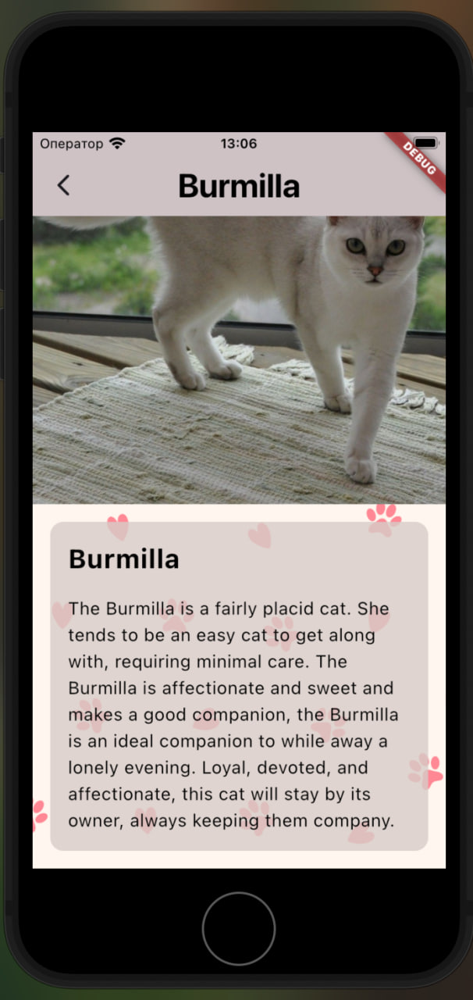
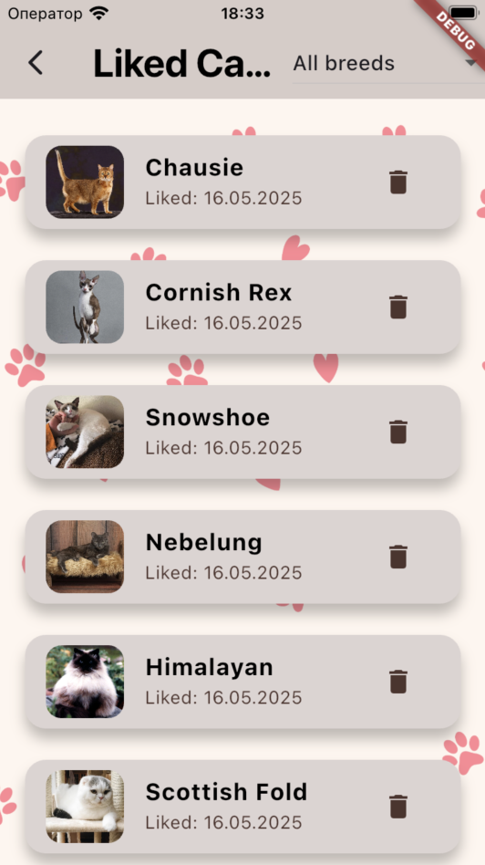
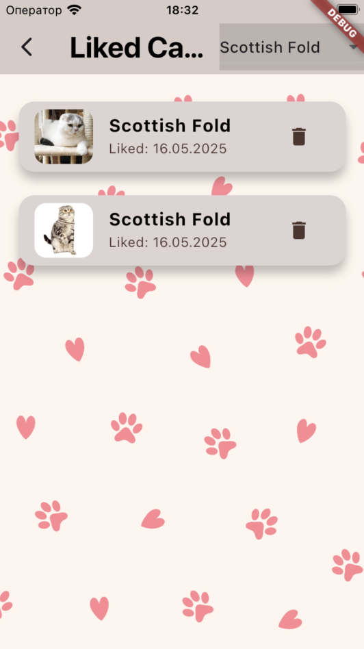
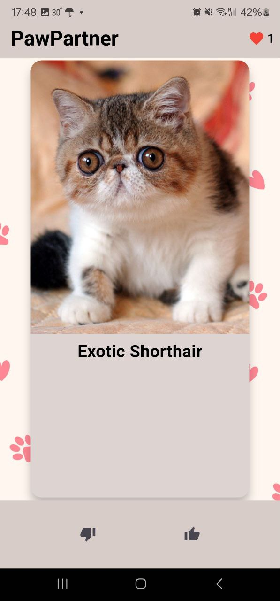
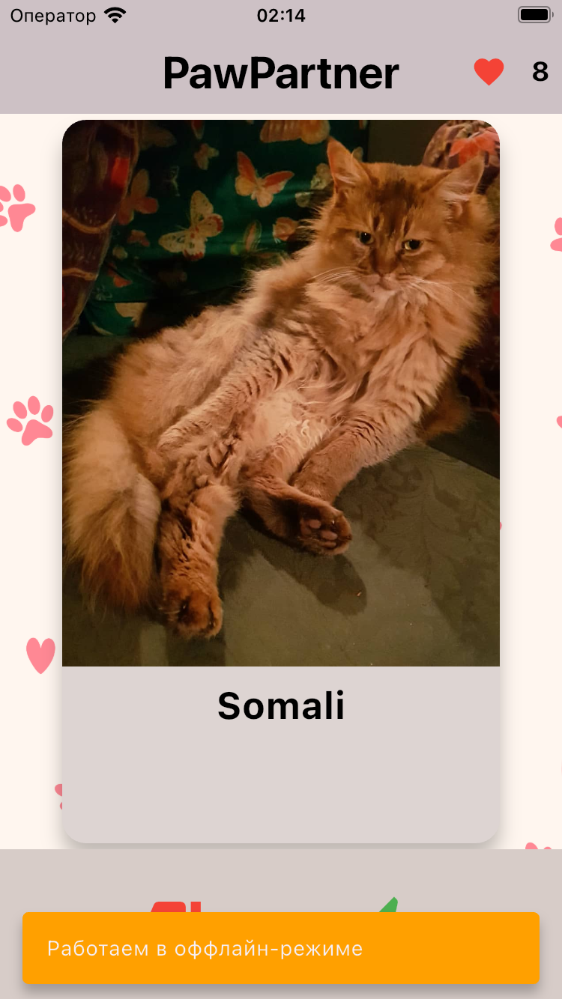
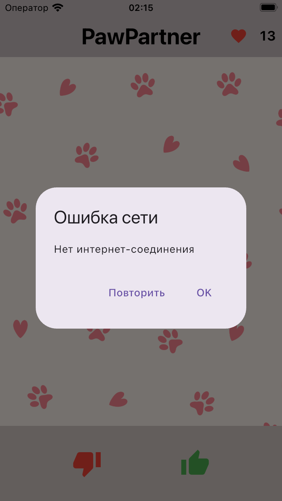

# PawPartner - Приложение для любителей котиков 🐾

**PawPartner** — это приложение, которое позволяет вам наслаждаться случайными фотографиями котиков, узнавать их породы и "лайкать" понравившихся

---

## Описание проекта

PawPartner — это аналог "Тиндера" для котиков. Вы можете:
- Просматривать случайные фотографии котиков.
- Узнавать их породы.
- "Лайкать" понравившихся котиков.
- Открывать детальную информацию о каждом котике.

Приложение использует [The Cat API](https://thecatapi.com/) для получения данных о котиках.

---

## Реализованные фичи

### Основные функции:
- **Случайные котики**: На главном экране отображается случайное изображение котика и его порода
- **Интерактивное взаимодействие**: 
  - Свайп влево (дизлайк) / вправо (лайк)
  - Кнопки для лайка и дизлайка
- **Лайкнутые котики**:
  - История лайкнутых котиков с датой
  - Возможность удаления из списка
  - Фильтрация по породам (выпадающий список)
- **Детальная информация**: Полное описание породы с увеличенным изображением
- **Обработка ошибок**: Уведомления о проблемах с сетью

### Оффлайн-режим:
- **Просмотр ранее загруженных котиков** без интернет-соединения
- **Сохранение лайков** между запусками приложения
- **Автоматическая синхронизация** при восстановлении соединения
- **Уведомление о статусе сети** без блокировки интерфейса
- **Кэширование изображений** для оффлайн-просмотра

## Скриншоты интерфейса

### Главный экран


### Экран деталей


### Экран лайков


### Фильтрация по породе


### Главный экран из apk версии


### Оффлайн-режим


### Уведомление о сети


---

## Скачать APK

Вы можете скачать актуальную версию APK по ссылке:  
[Скачать PawPartner APK](https://drive.google.com/drive/folders/1f201xWlKVJixcjleu5ZzZ7XY2GcEPEb2?usp=sharing)

---

## Как запустить проект

1. Убедитесь, что у вас установлен Flutter. Если нет, следуйте [официальной инструкции](https://flutter.dev/docs/get-started/install).
2. Клонируйте репозиторий:
   ```bash
   git clone https://github.com/ваш-username/pawpartner.git
   ```
3. Перейдите в папку проекта:
   ```bash
   cd pawpartner
   ```
4. Установите зависимости:
   ```bash
   flutter pub get
   ```
5. Запустите приложение:
   ```bash
   flutter run
   ```

---

## Используемые технологии

- **Flutter**: Основной фреймворк для разработки приложения.
- **The Cat API**: API для получения данных о котиках.
- **CachedNetworkImage**: Для кэширования изображений.
- **flutter_lints**: Для статического анализа кода.